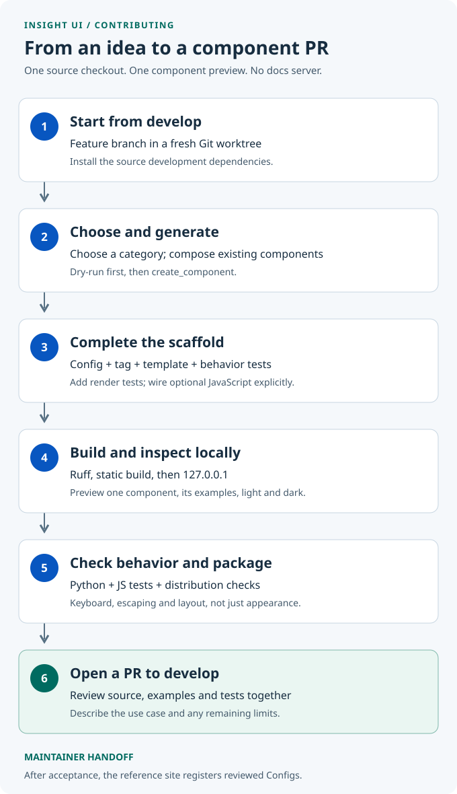

<!--
SPDX-FileCopyrightText: 2025-2026 Alpin Insight Solutions GmbH & Co. KG
SPDX-License-Identifier: AGPL-3.0-only
-->

# Contributing To Insight UI

Build reusable Django components here: their typed configuration, templates,
JavaScript when needed, source assets, and behavior tests. You do not need the
separate documentation application or access to private services to contribute.

The scaffold and preview commands are available on `develop`. Start from an
updated source checkout; an older installed wheel is not the contributor host.

## Package Reference

The [package guides](docs/README.md) are available in this repository without
access to the separate documentation application. Read the relevant guide when
changing a component rather than treating the generated skeleton as finished:

| Task | Guide |
| --- | --- |
| Use the package in a Django application | [Getting started](docs/getting-started.md) |
| Change Configs, tags or composition | [Components](docs/components.md) and [conventions](docs/conventions.md) |
| Change colors, surfaces, radii or shadows | [Design system](docs/design-system.md) |
| Build CSS/JS or serve package assets | [Static assets](docs/static-assets.md) |
| Add translated strings or RTL behavior | [Internationalization](docs/i18n.md) |
| Check keyboard, focus and ARIA behavior | [Accessibility](docs/accessibility.md) |
| Validate and submit a component | [Testing](docs/testing.md) and [component checklist](docs/new-component-checklist.md) |

## The Workflow



1. Create a feature branch and worktree from the latest `develop`.
2. Choose a category and inspect a dry-run before generating files.
3. Implement the component using existing Insight UI patterns.
4. Format the source, build local assets, and preview one component.
5. Test behavior and the package boundary, not only the screenshot.
6. Open a pull request to `develop`; maintainers handle the separate reference site.

## 1. Prepare A Source Worktree

Use Git, [uv](https://docs.astral.sh/uv/getting-started/installation/), and Node.js
with npm. Use the Python version in `.python-version` for local development;
the supported package versions are listed in the [README](README.md).

From a clone of this repository:

```bash
git fetch origin develop
git worktree add -b feat/example-panel ../insight-ui-example-panel origin/develop
cd ../insight-ui-example-panel
uv sync --locked --all-groups
npm ci
```

The commands assume `origin` points to the upstream repository. If working from
a fork, fetch the upstream remote and use its `develop` ref as the starting
point instead. Push your feature branch to your fork, not to upstream `develop`.

Run contributor commands from this worktree's root. The `devtools` preview host
is Git-checkout-only: neither the source distribution nor the installed wheel
includes it. Installing the library into an unrelated app is not a substitute
for this checkout. The basic preview needs no documentation app or database
migration; authentication and application endpoints need a separate test host.

## 2. Choose The Component Shape

Check the [component reference](https://insight-ui.com/docs/configs) and existing
source before adding a new component. Prefer composing existing components over
copying their markup or behavior.

| Level | Starting point | Implementation |
| --- | --- | --- |
| `atom` | One small primitive with its own configuration and template. | Implement its reusable contract. |
| `molecule` | A focused combination, such as a field and an action. | Compose existing Configs and tags explicitly. |
| `organism` | A larger functional section assembled from components. | Compose children and implement the layout and behavior. |

The level describes composition, not a generator option. The category describes
purpose and selects the existing configuration module. Neither creates a new
Config class hierarchy. `--level`, `--compose` and `--package-root` are not supported.
Categories are `layout`, `navigation`, `input`, `popup`, `util`, `list`, `filter`,
`card`, and `form`.

Preview the files for **Example Panel** without changing them:

```bash
uv run python manage.py create_component \
  --name "Example Panel" --category form --no-js --dry-run
```

`--dry-run` validates the request and lists paths without writing files. The
generator rejects existing component names and invalid source bindings. Resolve
the reported cause rather than overwriting another component.

The rest of this guide uses **Example Panel**. Generate it once by removing
`--dry-run`:

```bash
uv run python manage.py create_component \
  --name "Example Panel" --category form --no-js
```

Use `--js` instead of `--no-js` if your component needs a JavaScript skeleton.
Without either flag the command asks interactively. The skeleton is not finished
interaction logic. Do not run the generator a second time over an existing name.

## 3. Complete The Scaffold

For the example above, generation creates or updates these source files:

| File | Your responsibility |
| --- | --- |
| `insight_ui/configs/forms.py` | Define `ExamplePanelConfig` fields, defaults, and field documentation. Other categories use their corresponding module. |
| `insight_ui/configs/__init__.py` | Export the Config using the existing package API. |
| `insight_ui/templatetags/insight_tags.py` | Register the real `example_panel` inclusion tag. |
| `insight_ui/templates/insight_ui/components/example_panel.html` | Implement accessible markup; compose children through their existing tags. |

With `--js`, the generator also creates
`insight_ui/static/insight_ui/js/insight-ui-example-panel.js`; its selector matches
the generated template's `data-insight-*` attribute. Register it explicitly in
`insight-ui-init.js`: add its import, class in `window.InsightUI` and `initAll()`
call alongside the existing components. Follow their initialization and cleanup
patterns, including repeated HTMX initialization.

**Tests are not generated.** Add
`tests/insight_ui/unit/components/test_example_panel.py` following the
[button tests](tests/insight_ui/unit/components/test_button.py). Check defaults,
explicit Configs, `tag_id`, escaping and edge cases. Add
`tests/js/example-panel.test.js` for JS lifecycle and interaction behavior.

Use semantic design roles from `insight_ui/utils/input.css` before adding new
tokens. Keep colors, borders, radii, and shadows consistent with existing
components. Do not add private brand assets or a separate component-specific
palette to this public package.

## 4. Build And Preview Locally

Normalize generated imports and formatting, then compile and minify the assets:

```bash
uv run ruff check --fix
uv run ruff format
npm run build:static-all
uv run python manage.py runserver 127.0.0.1:8000
```

Open **[http://127.0.0.1:8000/](http://127.0.0.1:8000/)**. Stop the server with
`Ctrl+C`.

The playground renders Configs from `component_preview()` in `devtools/views.py`.
Import `ExamplePanelConfig` and add `"example_panel": ExamplePanelConfig(tag_id="example-panel-1")`
to its context. Replace the example tag in `devtools/templates/devtools/playground.html`
with ``.

The iframe renders the real base template with its own viewport: 375 pixels
also activates mobile CSS breakpoints. Check light/dark and RTL. This is not
device, touch or assistive-technology emulation. Open `/preview/` separately
for additional checks with your browser's developer tools.

The playground uses local package CSS, fonts, and JavaScript, with CDN delivery
disabled. No private credentials are needed, but this is not an offline
guarantee: the base template loads third-party HTMX. Optional chart/map/syntax
libraries are disabled until enabled in `devtools/settings.py`. Submission
endpoints, WebSocket services and remote data need an appropriate test host.

`build:static-all` compiles Tailwind from `input.css` and package sources, then
creates minified CSS/JS. **`build:static` alone only minifies existing assets.**
Rebuild after changing templates, classes, tokens, or JavaScript. Commit any
tracked readable asset changes, but do not force-add ignored `.min.css` or
`.min.js` files. Building locally does not publish to a CDN.

## 5. Check Behavior And Distribution

Start with the component test you added:

```bash
uv run pytest tests/insight_ui/unit/components/test_example_panel.py
```

If you added JavaScript, run its focused test too:

```bash
npm test -- tests/js/example-panel.test.js
```

Then run the package checks before opening the PR:

```bash
uv run ruff check --no-fix
uv run ruff format --check
uv run python -m django check --settings=tests.settings
uv run pytest
npm test
npm run verify:static-build
uv build
uv run python scripts/check_distribution.py
uv run --no-project python scripts/smoke_distribution.py
git diff --check
```

The tests use the package's minimal Django host, not the documentation app.
Keep Keyboard, ARIA, focus, and lifecycle behavior tests in the library when
they protect the component contract. Those tests and a local preview are not
a complete WCAG conformance audit of an application.

Pull requests run [credential-free Contributor CI](docs/testing.md#contributor-ci),
including separate installation tests for the built wheel and source archive.
The resulting CI artifacts follow the repository's visibility; they are not
an automatic PyPI or CDN publication. No private accounts are needed to submit
or test a component.

Check long text, missing optional values, escaping of untrusted text, repeated
instances, light/dark mode, and narrow screens. For interactive components, test
keyboard operation, accessible names, and focus behavior as well as mouse use.
The generator's own tests cover all categories in disposable package copies;
they do not replace tests of your new component's intended behavior.

## 6. Open A Pull Request

Review `git diff` and `git status` before staging. Include only the intended
source, tests, and tracked generated assets. Preserve the existing SPDX/REUSE
licensing conventions; see [LICENSE](LICENSE) and [NOTICE](NOTICE).

Push your feature branch and open a PR targeting **`develop`**, with a
Conventional Commit title such as `feat(components): add example panel`.
Explain the use case, why existing components are not enough, how composition
works, and which checks you ran. Mention any missing tests or known limits.

Include a useful preview image in the PR when appearance changes. Temporary
debugging screenshots, browser profiles, caches, and credentials do not belong
in the repository. Commit an image only when documentation references it or an
actual visual-regression test uses it as a baseline.

### Maintainer Handoff

The separate reference site registers reviewed public Configs, tags and templates
without duplicating their implementation. It owns its catalog examples and
editorial metadata. The generator creates no documentation manifest or catalog.
Maintainers coordinate that downstream change after acceptance. Contributors do not need private
documentation access: keep behavior tests here; the full catalog, documentation
application, and application-level audit evidence stay outside the public
package.
