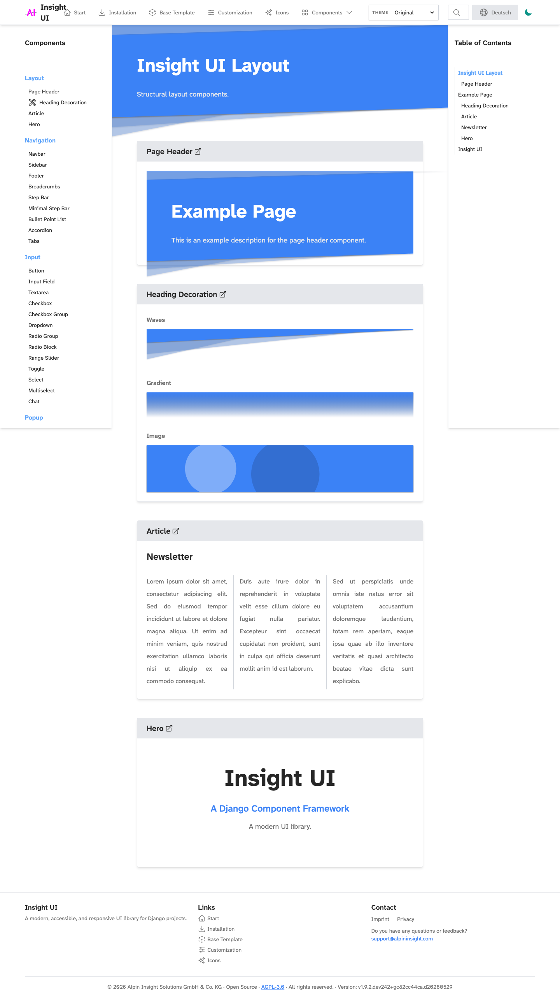
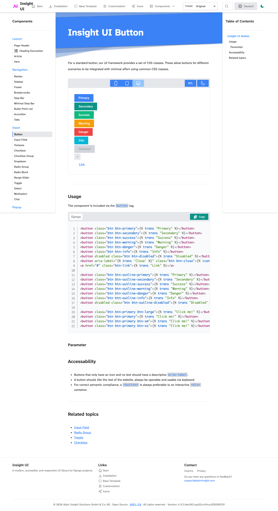
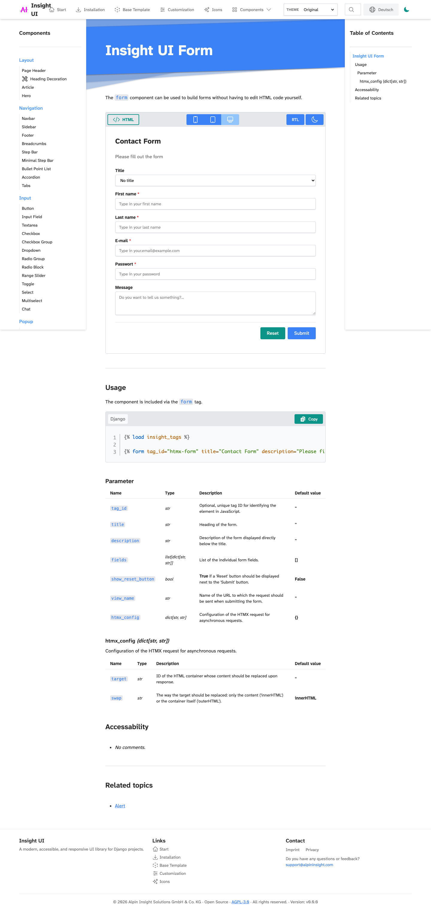
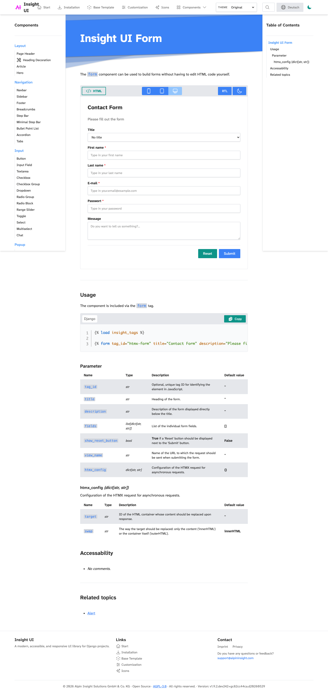
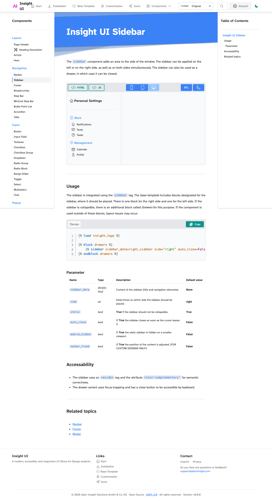
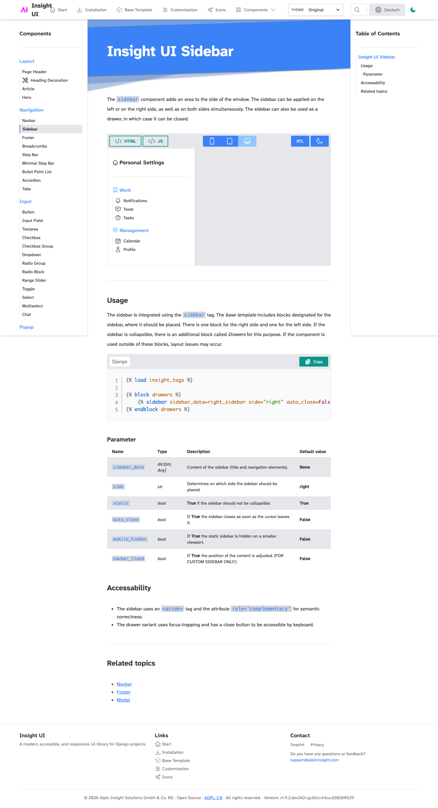
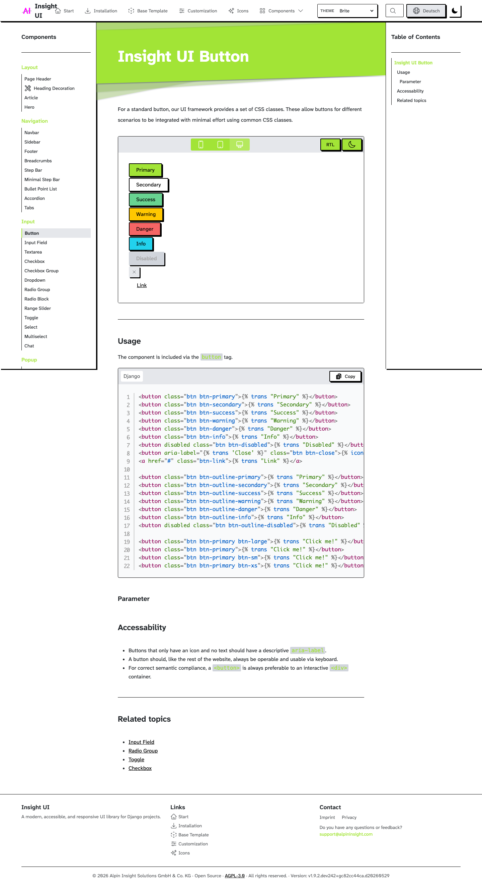
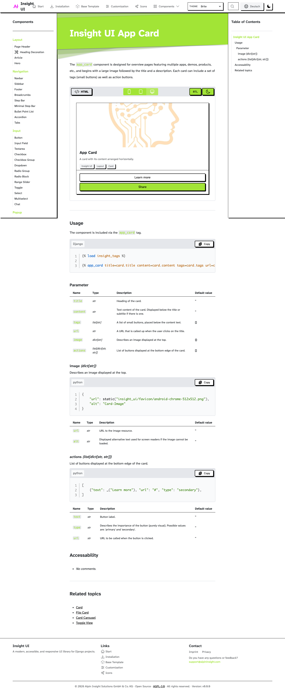
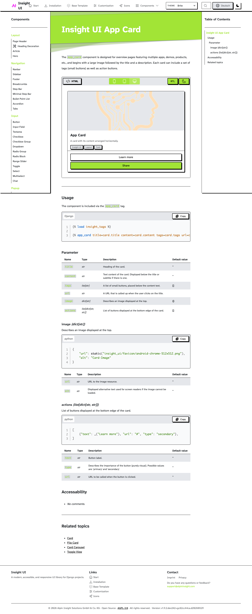

# Dark mode variable override

This document records the migration from duplicated `dark:*` component classes
and public `*-dark` token names to a single semantic token contract.

Dark mode now works by overriding the same public token names under
`[data-theme="dark"]`. Components keep using semantic classes such as
`text-primary`, `insight-surface-base`, `insight-border-surface`, and
`insight-shadow-surface`. This keeps host-project theming simpler because a
component no longer needs separate light and dark markup for the same concept.

## How to regenerate

Start the comparison servers first:

```bash
uv run python manage.py runserver 127.0.0.1:8010
uv run python manage.py runserver 127.0.0.1:8011
```

Then capture the two phases:

```bash
INSIGHT_UI_SCREENSHOT_BASE_URL=http://127.0.0.1:8010 \
INSIGHT_UI_SCREENSHOT_PHASE=before \
INSIGHT_UI_SCREENSHOT_OUTPUT=docs/assets/dark-mode-variable-override \
node scripts/capture-design-token-screenshots.mjs

INSIGHT_UI_SCREENSHOT_BASE_URL=http://127.0.0.1:8011 \
INSIGHT_UI_SCREENSHOT_PHASE=after \
INSIGHT_UI_SCREENSHOT_OUTPUT=docs/assets/dark-mode-variable-override \
node scripts/capture-design-token-screenshots.mjs
```

## Default overview

| Before | After |
|---|---|
|  |  |

## Default buttons

| Before | After |
|---|---|
|  |  |

## Default forms

| Before | After |
|---|---|
|  |  |

## Default navigation

| Before | After |
|---|---|
|  |  |

## Brite buttons

| Before | After |
|---|---|
|  |  |

## Brite surfaces

| Before | After |
|---|---|
|  |  |
