# Design token impact map

This document shows which visible UI areas are affected by the public design
tokens in `insight_ui/utils/input.css`.

The screenshots are intentionally stored as before/after pairs. They show the
state before the token migration in this pull request and the state after the
components were moved to semantic Insight UI tokens and classes.

## How to regenerate

Start the local demo server first:

```bash
uv run python manage.py runserver 127.0.0.1:8010
```

Then capture the two phases:

```bash
INSIGHT_UI_SCREENSHOT_PHASE=before node scripts/capture-design-token-screenshots.mjs
INSIGHT_UI_SCREENSHOT_PHASE=after node scripts/capture-design-token-screenshots.mjs
```

The script writes screenshots to `docs/assets/design-token-impact-map/`.

## Token areas

| Token area | Main tokens/classes | Typical affected UI |
|---|---|---|
| Brand colors | `--color-insight-primary`, `--color-insight-secondary`, foreground and interaction variants | buttons, links, focus accents, active states |
| Status colors | `success`, `warning`, `danger`, `info`, `pending` token families | alerts, infoboxes, step indicators, validation |
| Text hierarchy | `text-primary`, `text-secondary`, `text-link`, `text-disabled` | page copy, navigation, muted states |
| Surfaces | `--color-insight-surface-*`, `insight-surface-*` | page background, cards, forms, dropdowns, modals |
| Tonal elevation aliases | `canvas`, `panel`, `raised`, `sunken` | Brand-compatible names for the same surface ladder |
| Borders | `--color-insight-border-*`, `insight-border-*` | cards, tables, sidebars, form controls |
| Shadows | `--insight-shadow-*`, `insight-shadow-*` | buttons, controls, cards, overlays |
| Radius | `--insight-radius-*`, `insight-radius-*` | controls, cards, pills, overlays |
| Typography | `--font-sans`, `--font-display`, `--font-mono`, tracking tokens | headings, labels, code/documentation surfaces |

## Overview

| Before | After |
|---|---|
| 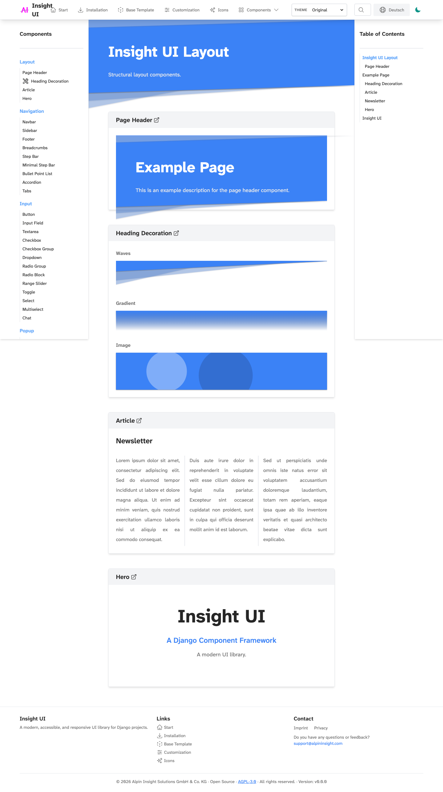 | 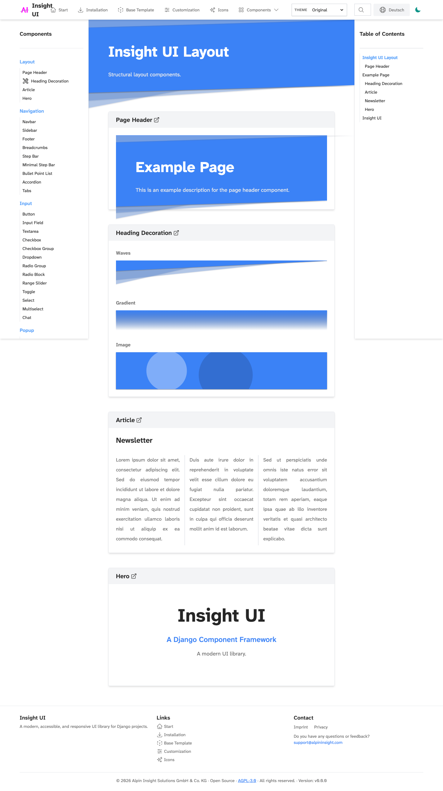 |

Affected areas: page surface, navbar surface, sidebar surface, dropdown surface,
border hierarchy, text hierarchy, and component list surfaces.

## Buttons

| Before | After |
|---|---|
| 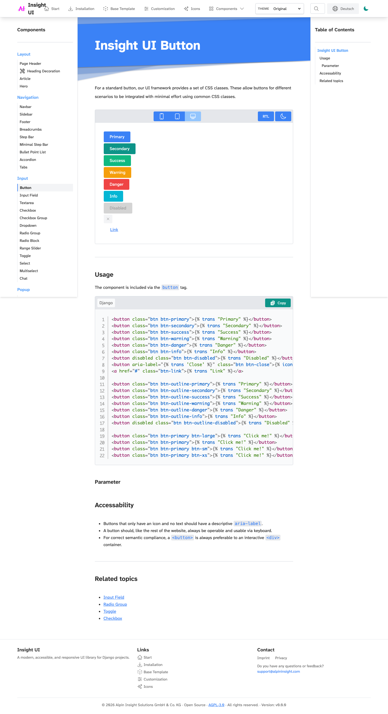 | 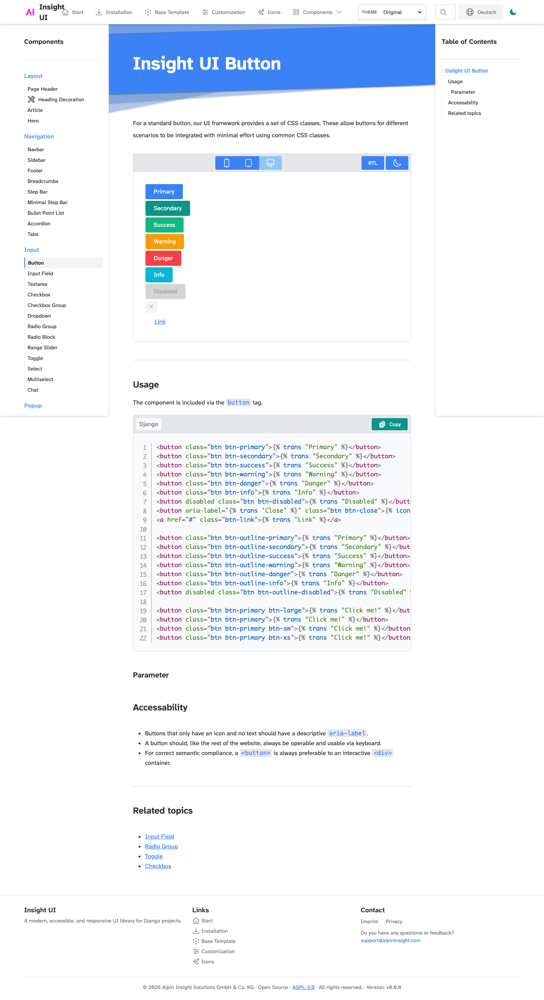 |

Affected areas: button foreground tokens, button border fallback tokens, button
shadow tokens, disabled tokens, radius-control, and focus/interaction states.

## Forms

| Before | After |
|---|---|
| 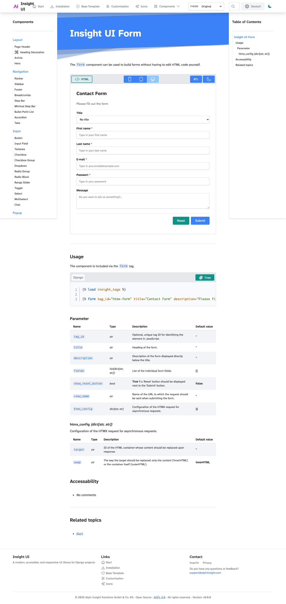 | 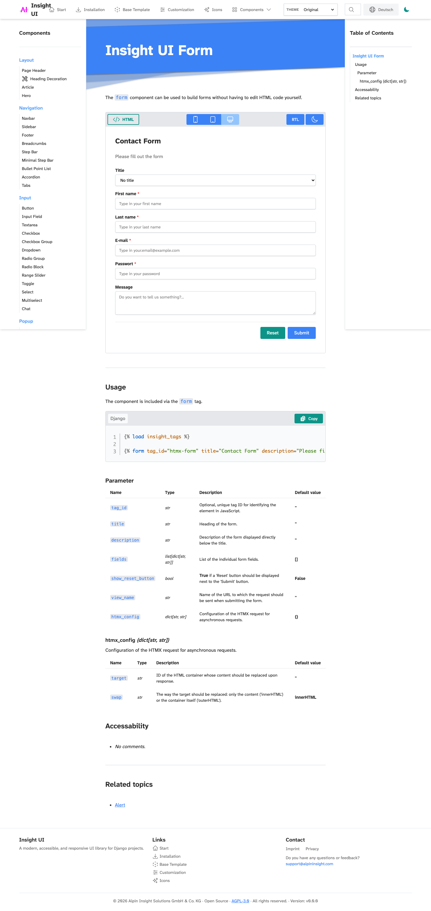 |

Affected areas: control surface, control border, control shadow, control radius,
validation/status colors, and disabled/muted text states.

## Cards And Surfaces

| Before | After |
|---|---|
| 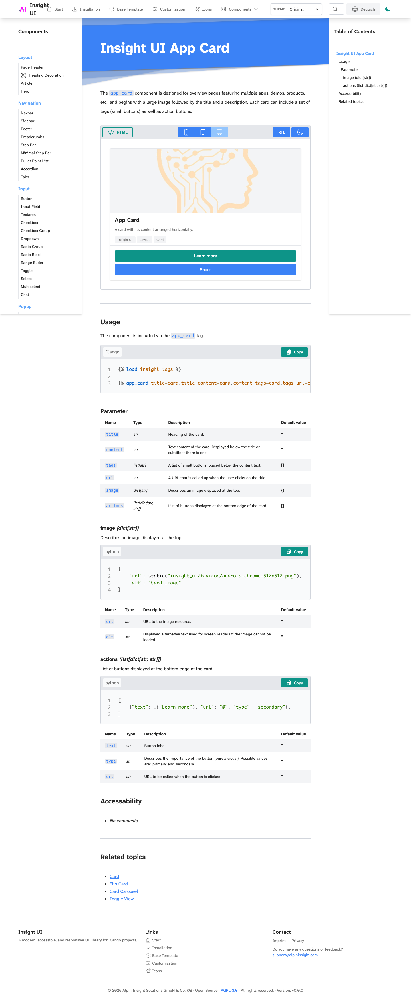 | 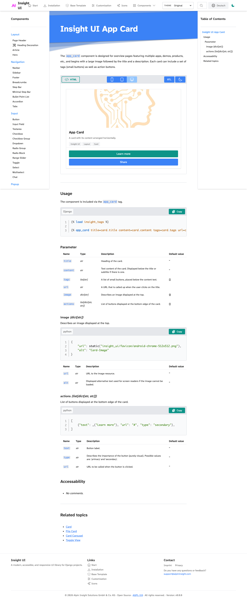 |

Affected areas: surface-base, surface-soft, surface border, surface shadow, and
surface radius.

## Navigation

| Before | After |
|---|---|
| 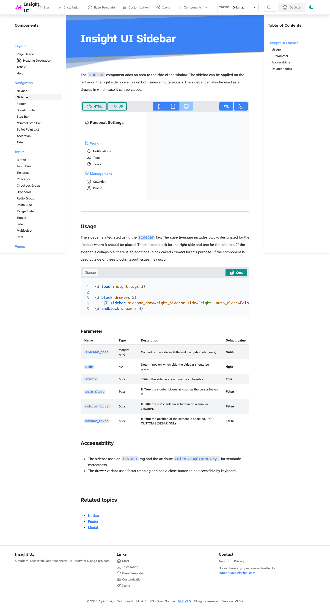 | 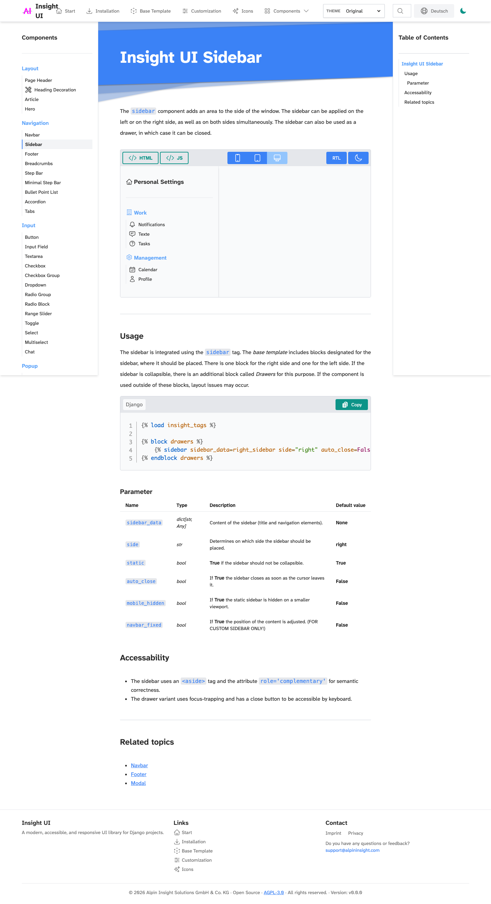 |

Affected areas: navbar, sidebar, selected item surface, inactive item borders,
hover surface, and overlay shadow.

## Feedback

| Before | After |
|---|---|
| 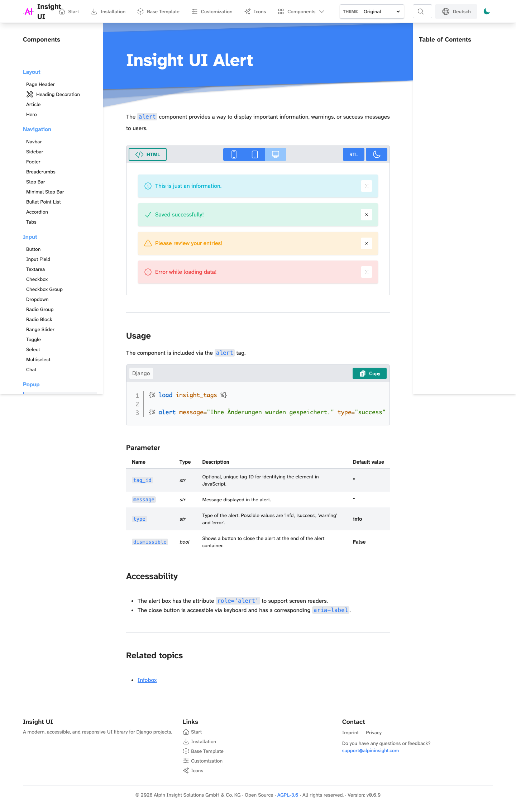 | 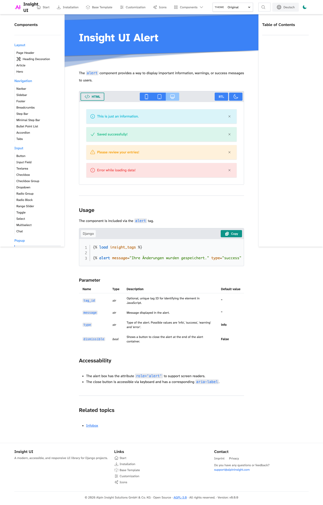 |

Affected areas: status color families, status foreground, feedback surface tint,
and feedback radius/shadow.

## Data Display

| Before | After |
|---|---|
| 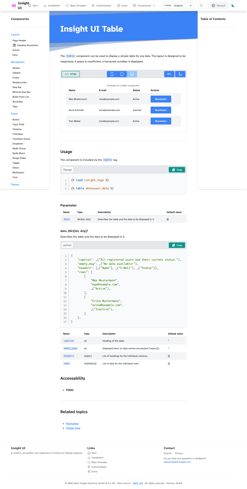 | 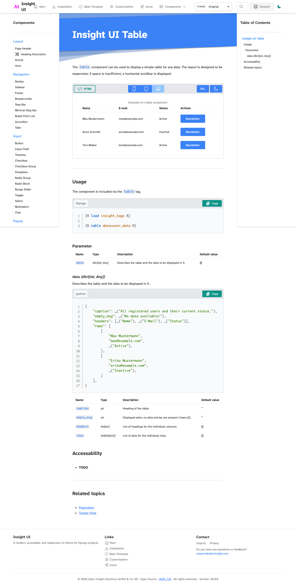 |

Affected areas: table surface, alternating row surfaces, border hierarchy, and
muted empty-state text.

## Range Slider

| Before | After |
|---|---|
| 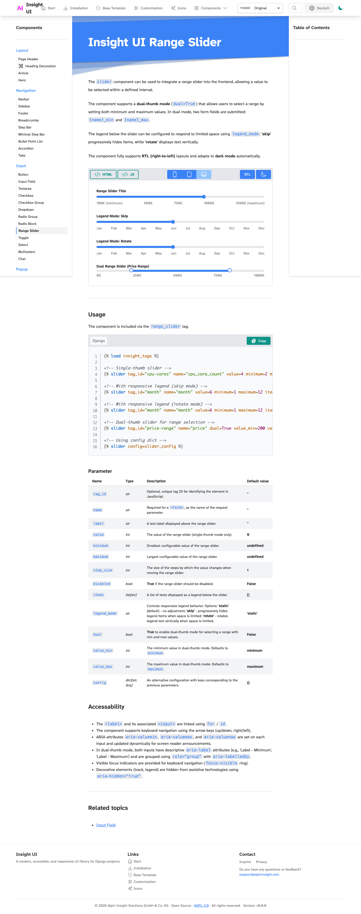 | 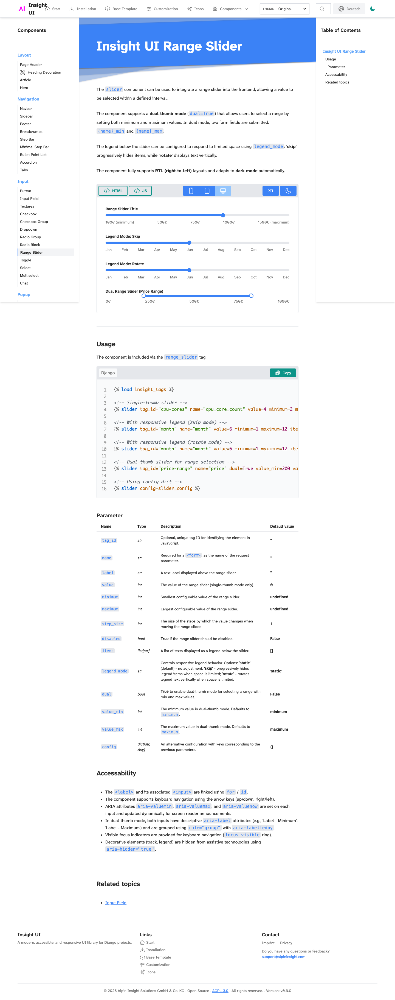 |

Affected areas: primary track color, inactive track surface, control radius,
thumb border, and focus ring.

## Brite Theme Smoke

| Before | After |
|---|---|
| 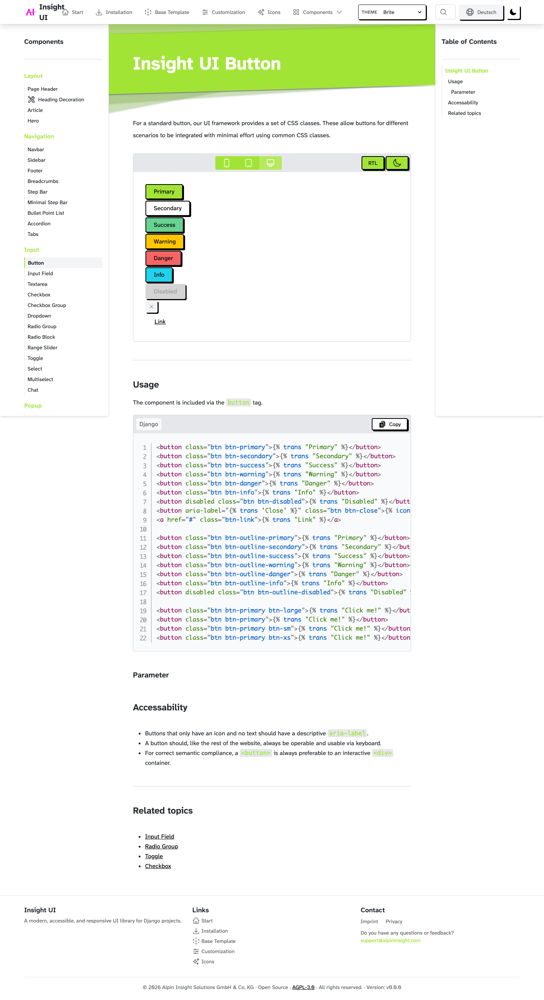 | 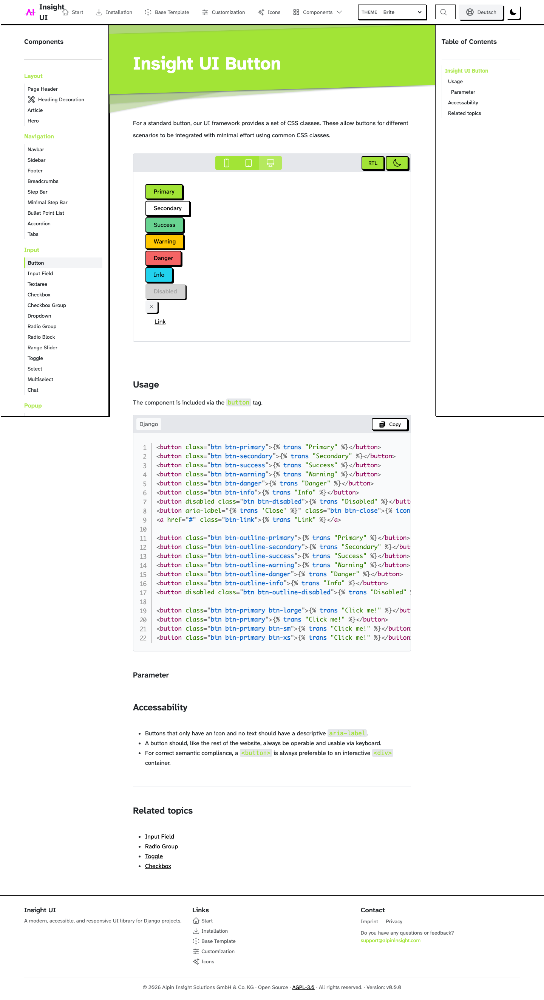 |

The Brite theme is the harshest smoke test because it uses white secondary
buttons with black borders and hard neobrutalist shadows. If surface, border, or
shadow tokens regress, this page usually shows it first.

## Remaining Follow-Up Areas

Some components still intentionally keep local implementation details. These are
not yet public design-system tokens:

- carousel positioning and image-caption overlays,
- pseudo-element slider thumb internals where browser support requires verbose
  utility selectors,
- one-off geometric decoration drop shadows,
- icon glyph selection.

Those values should only become public tokens when they repeat across multiple
components or need host-project override support.
