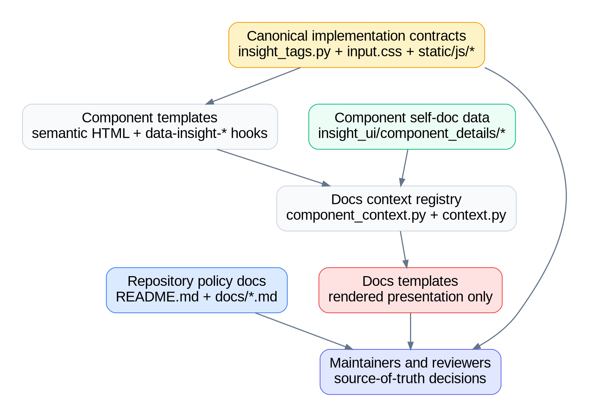
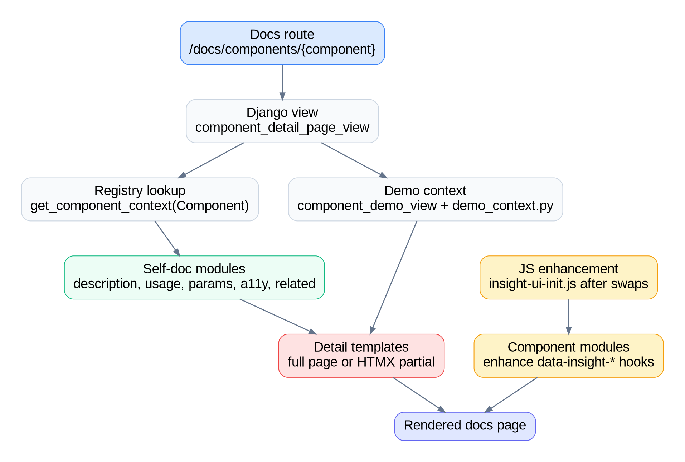
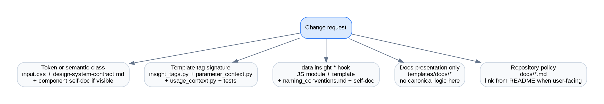

# Documentation architecture

This document explains how Insight UI documentation is structured and where
maintainers should place different kinds of information. Treat these rules as
policy: documentation templates render the docs, but they are not the deepest
source of truth for component behavior, design tokens, or API contracts.

## Source-of-truth policy

| Surface | Responsibility | Rule |
|---|---|---|
| `README.md` | Package overview, install, quick start, and links | Keep it short and user-facing. Link to deeper docs instead of duplicating policy. |
| `docs/design-system-contract.md` | Stable public design contract | Define reusable design concepts, tokens, semantic classes, and contract boundaries. |
| `docs/naming_conventions.md` | Naming rules and hook conventions | Define stable naming for Python, templates, CSS, assets, and `data-insight-*` hooks. |
| `docs/contributing.md` | Contributor workflow and decision rules | Explain how contributors change components, docs, tests, and public contracts. |
| `insight_ui/component_details/*` | Per-component self-documentation data | Own component descriptions, usage examples, parameters, accessibility notes, related topics, and demo context. |
| `insight_ui/templatetags/insight_tags.py` | Django API source of truth | Own template tag signatures, parameter defaults, context normalization, and Django-facing component APIs. |
| `insight_ui/utils/input.css` | Token and reusable class source of truth | Own public tokens, base styles, and semantic reusable classes. Generated CSS is output, not the contract. |
| `insight_ui/static/insight_ui/js/*` | Behavior hook source of truth | Own JavaScript state, lifecycle, event handling, and `data-insight-*` behavior contracts. |
| `insight_ui/templates/insight_ui/docs/*` | Rendered documentation presentation | Compose and present documentation. Do not move canonical behavior, API, or design rules here. |

Diagram source

## Documentation pipeline

The self-documenting application is built from three layers:

1. Component context data in `insight_ui/component_details/`.
2. Django views and context helpers that assemble page context.
3. Documentation templates that render the assembled context into full pages or
   HTMX partials.

`component_context.py` is the registry for per-component documentation. Context
builders use `@register_component(Component.X)` and contribute dictionaries for
description, usage, parameters, accessibility, and related topics.

`component_detail_page_view()` receives a component name, resolves the
registered context with `get_component_context(Component(component_name))`, adds
demo metadata, and renders either `component_detailpage.html` or the HTMX
partial `component_detailpage_partial.html`.

`storybook_view()` receives a component category, uses `get_storybook_context()`
from `context.py`, and renders either `storybook.html` or
`storybook_partial.html`. The shared component list presentation lives in
`storybook_content.html`.

Diagram source

## Runtime layers

Insight UI components should stay aligned across these runtime layers:

| Layer | Canonical location | Responsibility |
|---|---|---|
| Django template tag API | `insight_ui/templatetags/insight_tags.py` | Public Django-facing signature, defaults, and normalized context. |
| Component HTML | `insight_ui/templates/insight_ui/components/` | Semantic structure, ARIA, data hooks, and default Tailwind implementation. |
| Design tokens and classes | `insight_ui/utils/input.css` | Theme tokens, base styles, and reusable semantic classes. |
| JavaScript behavior | `insight_ui/static/insight_ui/js/` | Initialization, lifecycle, state, events, and hook behavior. |
| Self-doc data | `insight_ui/component_details/` | User-facing component explanation, examples, parameter docs, and accessibility notes. |
| Rendered docs presentation | `insight_ui/templates/insight_ui/docs/` | Layout and display of docs pages, demos, storybook pages, and HTMX partials. |

`insight-ui-init.js` imports component modules, exposes them through
`window.InsightUI`, initializes all components on `DOMContentLoaded`, and
re-initializes after HTMX swaps. Component modules must therefore be safe to run
more than once on the same DOM by using their singleton/lifecycle pattern.

## Where a concern belongs

Use this routing rule when reviewing or implementing documentation changes:

Diagram source

| Change type | Required documentation update |
|---|---|
| Token or semantic class | Update `insight_ui/utils/input.css` and `docs/design-system-contract.md`; update component self-doc if users see or configure it. |
| Template tag signature or parameter behavior | Update `insight_ui/templatetags/insight_tags.py`, `component_details/parameter_context.py`, `component_details/usage_context.py`, and tests. |
| `data-insight-*` hook | Update the owning JS module, component template, `docs/naming_conventions.md`, and component self-doc. |
| Component docs text, usage, parameters, or accessibility | Update `insight_ui/component_details/*`; do not encode this primarily in docs templates. |
| Storybook or detail-page layout | Update `insight_ui/templates/insight_ui/docs/*`; keep canonical API, token, and behavior rules in their owning files. |
| Repository-level contributor policy | Update `docs/*.md`; add a README link only when the doc is useful as a public entry point. |

## Kroki diagram maintenance

Documentation diagrams are rendered through
`https://kroki.showcase.alpininsight.ai/` as SVG image links so they are visible
in GitHub Markdown. The diagram source is kept next to each image in a
collapsible `dot` block. If the source changes, regenerate the Kroki URL from
the updated Graphviz source using Kroki's deflate plus URL-safe base64 encoding.
