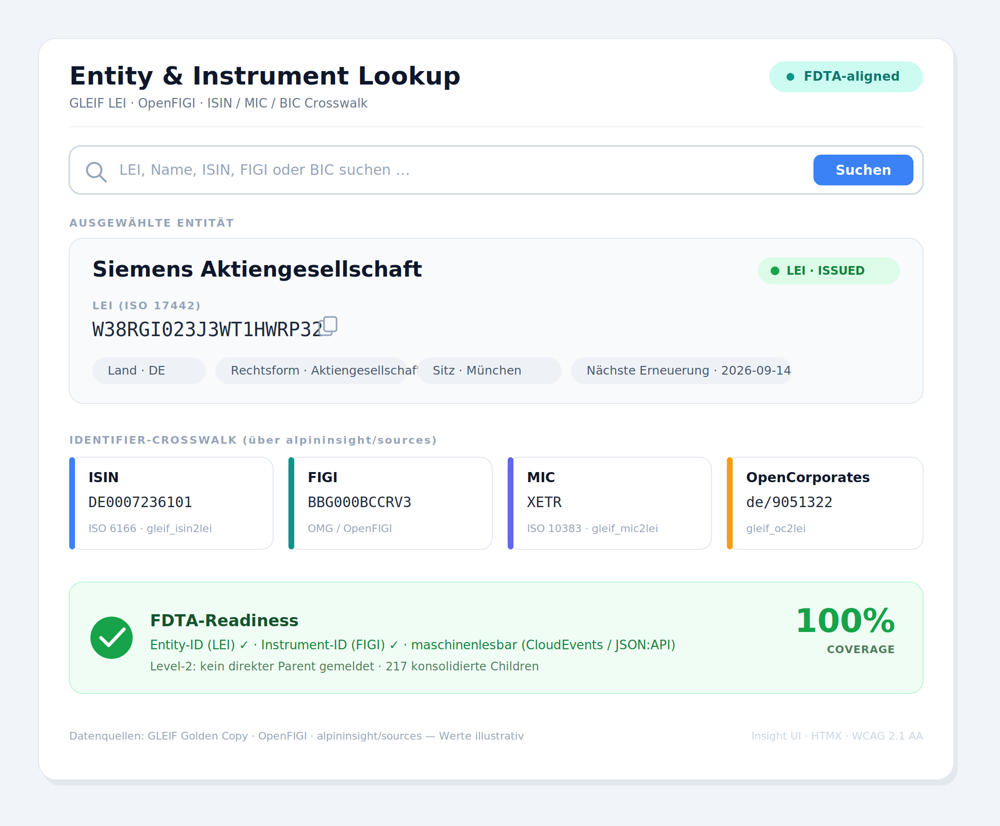

# App-Vorschlag: Insight FDTA — Entity & Instrument Intelligence (LEI/FIGI)

> **Hinweis:** Dieser Vorschlag wurde zunächst im `insight-ui`-Repo abgelegt, weil nur
> dieses Repo im Session-Scope schreibbar war. Er ist zum **Transfer in das neue
> App-Repo** vorgesehen.

## Zusammenfassung
Neue Django-App **„Insight FDTA"** auf Basis der **Insight UI**-Komponenten, gespeist aus
dem **`alpininsight/sources`**-Stack. Sie liefert LEI/FIGI-Lookup, Identifier-Crosswalks
und einen FDTA-Readiness-Score — als Antwort auf die neuen SEC-/FDTA-Joint-Data-Standards.

## Regulatorischer Anlass
Die SEC hat am 08.06.2026 die **Joint Data Standards** unter dem **Financial Data
Transparency Act of 2022 (FDTA)** final beschlossen (PR 2026-53). Kernpflichten:
nicht-proprietärer **LEI** für Entitäten, **FIGI** für Instrumente, offene
maschinenlesbare Schemata. Die Einzel-Rules der neun Agencies sollen bis Ende 2026
wirksam werden.

- SEC PR 2026-53: <https://www.sec.gov/newsroom/press-releases/2026-53-sec-establishes-joint-data-standards-required-under-financial-data-transparency-act-2022>
- SEC Proposal 2024-93 (LEI/FIGI benannt): <https://www.sec.gov/newsroom/press-releases/2024-93>

## Datenbasis (vorhanden in `alpininsight/sources`)
- `rest_api/gleif` — LEI-Records + 8 governte Code-Listen (`services_candidate: yes`, `source_role: service_lookup`)
- `rest_api/openfigi` + `services/openfigi-service` — FIGI
- `files_csv/gleif_isin2lei | mic2lei | bic2lei | oc2lei | gem2lei | qcc2lei` — Crosswalks (full historical mirror)
- Kontext: `rest_api/federal_register` (SEC-Rules), `files_csv/tradeweb_mifid`, `files_csv/sp500`, `files_csv/naics_nace`

## Features (→ Insight-UI-Komponenten)
- **Entity & Instrument Lookup** (siehe Mockup) — `search_bar` + HTMX-Partial
- **LEI-Status-Badge** (ISSUED/LAPSED) — Badge/Alert, Status über Farbe **und** Text (WCAG 2.1 AA)
- **Identifier-Crosswalk-Karten** (ISIN/FIGI/MIC/OpenCorporates) — Card-Grid
- **FDTA-Readiness-Panel** + Coverage-Score — Progress/Stat-Komponente
- **Portfolio-Coverage-Tabelle** (Lücken rot markiert) — `table` mit Filter/Suche
- **Level-2-Hierarchie** (Parent/Children) — optional via `insight-ui-charts`

## Architektur (Skizze)
`sources` (Acquisition → Redpanda/S3) → `services` (LEI/FIGI Lookup-API) →
**Insight FDTA App** (Insight-UI-Frontend, HTMX) → Nutzer. Auth via `insight-oidc`.

## Meilensteine
- [ ] M1: Lookup-Komponente (LEI/FIGI) als Insight-UI-Komponente + HTMX-Endpoint
- [ ] M2: Crosswalk-Service-Anbindung (ISIN/MIC/BIC → LEI)
- [ ] M3: FDTA-Readiness-Score + Coverage-Tabelle
- [ ] M4: Portfolio-Upload + Audit-Export (maschinenlesbar)

## Offene Punkte
- GLEIF/OpenFIGI von `experimental` → `stable` heben (Service-SLA)
- LEI-Lifecycle-/Validierungslayer (ISO 17442 Prüfziffer, Lapsed-Status) als Service oder in-App?
- Scope v1: nur US-FDTA oder EU (ESMA/MiFID) gleich mitdenken?
